  
  
  
  

---

## What I work on

I split my time between research that asks *why models behave the way they do* and engineering
that puts those models in front of real users. Both halves feed each other.

<table>
<tr>
<th width="50%">Research</th>
<th width="50%">Engineering</th>
</tr>
<tr valign="top">
<td>

- **Trustworthy ML & alignment** — making model behavior predictable, auditable, and safe to depend on
- **Learning dynamics & influence analysis** — per-update gradient tracing to attribute behavior to training data
- **RLHF & preference optimization** — how preference data and policy optimization shape behavior
- **LLM security** — jailbreaks, data poisoning, and governing third-party agent extensions
- **Agentic AI & RAG** — tool-using agents, orchestration graphs, grounded retrieval with honest citations
- **Computer vision & multimodal** — detection and pose pipelines (YOLO, ViT-Pose); text ↔ image ↔ video
- **Scalable deployment** — GPU serving, containerized inference, reproducible training infra

</td>
<td>

- **Backend & APIs** — FastAPI, Django, Flask, Node; REST and GraphQL over Postgres, MongoDB, Redis
- **Frontend** — React, Next.js, Vue, TypeScript, Tailwind, Three.js — accessible and fast by default
- **Cloud & DevOps** — Docker, Kubernetes, GCP/AWS/Azure, GitHub Actions CI/CD, Nginx
- **Systems & OS** — Linux internals, C/C++/Rust, shell and process tooling, containers from the ground up
- **System design** — service boundaries, caching layers, data modeling, and the failure modes of each
- **Data engineering** — ingestion, cleaning, feature pipelines, warehouse-backed analytics
- **Automation** — CI pipelines, scheduled jobs, and bots that remove manual steps

</td>
</tr>
</table>

> Ph.D. Research Assistant at the **University of Cincinnati** · part-time Research Assistant at the **P&G Digital Accelerator**

## Research interests

**Active** — where my current work lives.

  
  
  
  
  
  
  
  
  
  
  

**In preparation** — adjacent ground I read into and expect to work in next.

  
  
  
  
  
  
  
  
  
  
  
  

Each of these has a page with context on **[mansurpro.netlify.app/research](https://mansurpro.netlify.app/research)**.

## Selected work

<b>AI, LLMs &amp; agents</b>

 

| Project | What it does |
|---|---|
| **[Multi-Agent Deep Research](https://github.com/MansurPro/LangGraph-deep-research)** | LangGraph supervisor/worker workflow that plans research, gathers live evidence, extracts structured findings with Pydantic schemas, and writes sourced reports |
| **[RAG Assistant](https://github.com/MansurPro/RAG-assistant)** | Modular retrieval-augmented generation pipeline — ingestion, chunking, embeddings, ChromaDB semantic search, conversational interface |
| **[Prompt2Clip](https://github.com/MansurPro/Prompt2Clip)** | Text-to-video generation on scalable cloud GPU infrastructure using the Mochi model |

<b>Data, cloud &amp; full-stack</b>

 

| Project | What it does |
|---|---|
| **[Retail Intelligence Platform](https://github.com/MansurPro/retail-intelligence-platform)** | End-to-end Azure analytics — customer lifetime value, churn risk, basket associations — served through FastAPI + React with a SQL-backed dashboard cache |
| **[DocuParse](https://github.com/MansurPro/DocuParse)** | PDF/EPUB/MOBI → clean structured Markdown, with AI layout detection, LaTeX equation handling, and multilingual support |
| **[College Inquiry Chatbot](https://github.com/MansurPro/gcp-college-inquiry-chatbot)** | Cloud-native conversational system on GCP that answers prospective-student questions |

<b>Systems &amp; fundamentals</b>

 

| Project | What it does |
|---|---|
| **[DigitRecognizer](https://github.com/MansurPro/DigitRecognizer)** | MNIST classifier written from scratch in NumPy — forward pass, backprop, gradient descent, zero frameworks |
| **[DinoMind Evolution](https://github.com/MansurPro/DinoMindEvolution)** | NEAT neuroevolution learns a timing-critical game with no gradients and no labeled data |

More at **[mansurpro.netlify.app](https://mansurpro.netlify.app)**.

## Languages and tools

<table>
  <tr valign="center">
    <td><strong>Languages&nbsp;&&nbsp;core</strong></td>
    <td></td>
  </tr>
  <tr valign="center">
    <td><strong>AI&nbsp;/&nbsp;ML&nbsp;/&nbsp;data</strong></td>
    <td></td>
  </tr>
  <tr valign="center">
    <td><strong>Backend&nbsp;&&nbsp;APIs</strong></td>
    <td></td>
  </tr>
  <tr valign="center">
    <td><strong>Frontend</strong></td>
    <td></td>
  </tr>
  <tr valign="center">
    <td><strong>Databases</strong></td>
    <td></td>
  </tr>
  <tr valign="center">
    <td><strong>Cloud,&nbsp;DevOps&nbsp;&&nbsp;OS</strong></td>
    <td></td>
  </tr>
  <tr valign="center">
    <td><strong>Tools&nbsp;&&nbsp;platforms</strong></td>
    <td></td>
  </tr>
  <tr valign="center">
    <td><strong>Also</strong></td>
    <td>
      
      
    </td>
  </tr>
</table>

## GitHub stats

  
  

---

  <em>Open to research collaborations and industry opportunities.</em> 
  <a href="mailto:sataromk@mail.uc.edu">sataromk@mail.uc.edu</a> ·
  <a href="https://www.linkedin.com/in/mansurbek/">LinkedIn</a> ·
  <a href="https://mansurpro.netlify.app">mansurpro.netlify.app</a>

