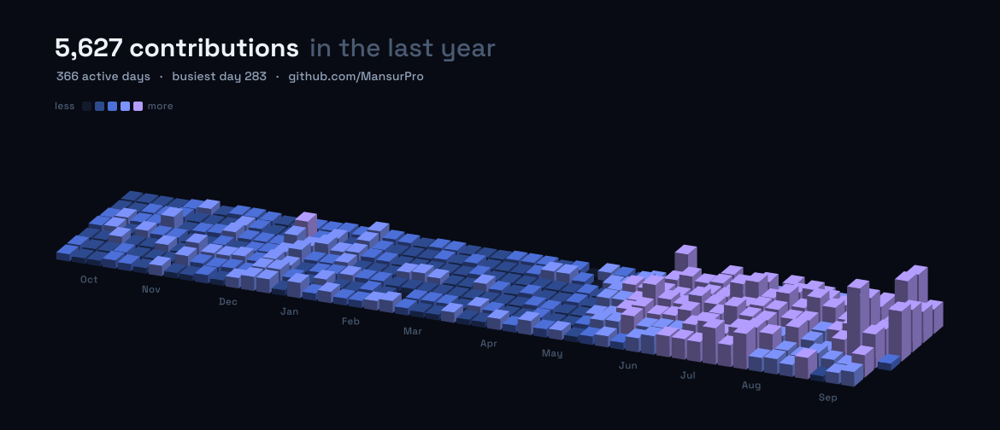

  
  
  
  

---

## What I work on

I split my time between research that asks *why models behave the way they do* and engineering
that puts those models in front of real users. Both halves feed each other.

<table>
<tr>
<th width="50%">Research</th>
<th width="50%">Engineering</th>
</tr>
<tr valign="top">
<td>

- **Trustworthy ML & alignment** — making model behavior predictable, auditable, and safe to depend on
- **Learning dynamics & influence analysis** — per-update gradient tracing to attribute behavior to training data
- **RLHF & preference optimization** — how preference data and policy optimization shape behavior
- **LLM security** — jailbreaks, data poisoning, and governing third-party agent extensions
- **Agentic AI & RAG** — tool-using agents, orchestration graphs, grounded retrieval with honest citations
- **Computer vision & multimodal** — detection and pose pipelines (YOLO, ViT-Pose); text ↔ image ↔ video
- **Scalable deployment** — GPU serving, containerized inference, reproducible training infra

</td>
<td>

- **Backend & APIs** — FastAPI, Django, Flask, Node; REST and GraphQL over Postgres, MongoDB, Redis
- **Frontend** — React, Next.js, Vue, TypeScript, Tailwind, Three.js — accessible and fast by default
- **Cloud & DevOps** — Docker, Kubernetes, GCP/AWS/Azure, GitHub Actions CI/CD, Nginx
- **Systems & OS** — Linux internals, C/C++/Rust, shell and process tooling, containers from the ground up
- **System design** — service boundaries, caching layers, data modeling, and the failure modes of each
- **Data engineering** — ingestion, cleaning, feature pipelines, warehouse-backed analytics
- **Automation** — CI pipelines, scheduled jobs, and bots that remove manual steps

</td>
</tr>
</table>

> Ph.D. Research Assistant at the **University of Cincinnati** · part-time Research Assistant at the **P&G Digital Accelerator**

## Research interests

**Active** — where my current work lives.

  
  
  
  
  
  
  
  
  
  
  

**In preparation** — adjacent ground I read into and expect to work in next.

  
  
  
  
  
  
  
  
  
  
  
  

Each of these has a page with context on **[mansurpro.netlify.app/research](https://mansurpro.netlify.app/research)**.

## Selected work

<b>AI, LLMs &amp; agents</b>

 

| Project | What it does |
|---|---|
| **[Multi-Agent Deep Research](https://github.com/MansurPro/LangGraph-deep-research)** | LangGraph supervisor/worker workflow that plans research, gathers live evidence, extracts structured findings with Pydantic schemas, and writes sourced reports |
| **[RAG Assistant](https://github.com/MansurPro/RAG-assistant)** | Modular retrieval-augmented generation pipeline — ingestion, chunking, embeddings, ChromaDB semantic search, conversational interface |
| **[Prompt2Clip](https://github.com/MansurPro/Prompt2Clip)** | Text-to-video generation on scalable cloud GPU infrastructure using the Mochi model |

<b>Data, cloud &amp; full-stack</b>

 

| Project | What it does |
|---|---|
| **[Retail Intelligence Platform](https://github.com/MansurPro/retail-intelligence-platform)** | End-to-end Azure analytics — customer lifetime value, churn risk, basket associations — served through FastAPI + React with a SQL-backed dashboard cache |
| **[DocuParse](https://github.com/MansurPro/DocuParse)** | PDF/EPUB/MOBI → clean structured Markdown, with AI layout detection, LaTeX equation handling, and multilingual support |
| **[College Inquiry Chatbot](https://github.com/MansurPro/gcp-college-inquiry-chatbot)** | Cloud-native conversational system on GCP that answers prospective-student questions |

<b>Systems &amp; fundamentals</b>

 

| Project | What it does |
|---|---|
| **[DigitRecognizer](https://github.com/MansurPro/DigitRecognizer)** | MNIST classifier written from scratch in NumPy — forward pass, backprop, gradient descent, zero frameworks |
| **[DinoMind Evolution](https://github.com/MansurPro/DinoMindEvolution)** | NEAT neuroevolution learns a timing-critical game with no gradients and no labeled data |

More at **[mansurpro.netlify.app](https://mansurpro.netlify.app)**.

## Tech I actually use

<b>Languages & core</b> &nbsp;14

 

<table>
  <tr>
    <td align="center" width="110"> <b>Python</b></td>
    <td align="center" width="110"> <b>JavaScript</b></td>
    <td align="center" width="110"> <b>TypeScript</b></td>
    <td align="center" width="110"> <b>Java</b></td>
    <td align="center" width="110"> <b>Rust</b></td>
    <td align="center" width="110"> <b>C</b></td>
    <td align="center" width="110"> <b>C++</b></td>
  </tr>
  <tr>
    <td align="center" width="110"> <b>PHP</b></td>
    <td align="center" width="110"> <b>R</b></td>
    <td align="center" width="110"> <b>Bash</b></td>
    <td align="center" width="110"> <b>PowerShell</b></td>
    <td align="center" width="110"> <b>Regex</b></td>
    <td align="center" width="110"> <b>LaTeX</b></td>
    <td align="center" width="110"> <b>WebAssembly</b></td>
  </tr>
</table>

<b>AI / ML / data</b> &nbsp;5

 

<table>
  <tr>
    <td align="center" width="110"> <b>PyTorch</b></td>
    <td align="center" width="110"> <b>TensorFlow</b></td>
    <td align="center" width="110"> <b>scikit-learn</b></td>
    <td align="center" width="110"> <b>OpenCV</b></td>
    <td align="center" width="110"> <b>Anaconda</b></td>
    <td width="110"></td>
    <td width="110"></td>
  </tr>
</table>

<b>Backend & APIs</b> &nbsp;7

 

<table>
  <tr>
    <td align="center" width="110"> <b>Django</b></td>
    <td align="center" width="110"> <b>Flask</b></td>
    <td align="center" width="110"> <b>FastAPI</b></td>
    <td align="center" width="110"> <b>Node.js</b></td>
    <td align="center" width="110"> <b>Rails</b></td>
    <td align="center" width="110"> <b>GraphQL</b></td>
    <td align="center" width="110"> <b>Nginx</b></td>
  </tr>
</table>

<b>Frontend</b> &nbsp;14

 

<table>
  <tr>
    <td align="center" width="110"> <b>React</b></td>
    <td align="center" width="110"> <b>Next.js</b></td>
    <td align="center" width="110"> <b>Vue</b></td>
    <td align="center" width="110"> <b>Nuxt</b></td>
    <td align="center" width="110"> <b>Redux</b></td>
    <td align="center" width="110"> <b>jQuery</b></td>
    <td align="center" width="110"> <b>Tailwind</b></td>
  </tr>
  <tr>
    <td align="center" width="110"> <b>Bootstrap</b></td>
    <td align="center" width="110"> <b>Material UI</b></td>
    <td align="center" width="110"> <b>Sass</b></td>
    <td align="center" width="110"> <b>Three.js</b></td>
    <td align="center" width="110"> <b>SVG</b></td>
    <td align="center" width="110"> <b>Vite</b></td>
    <td align="center" width="110"> <b>Webpack</b></td>
  </tr>
</table>

<b>Databases</b> &nbsp;7

 

<table>
  <tr>
    <td align="center" width="110"> <b>PostgreSQL</b></td>
    <td align="center" width="110"> <b>MySQL</b></td>
    <td align="center" width="110"> <b>MongoDB</b></td>
    <td align="center" width="110"> <b>Redis</b></td>
    <td align="center" width="110"> <b>SQLite</b></td>
    <td align="center" width="110"> <b>Supabase</b></td>
    <td align="center" width="110"> <b>Firebase</b></td>
  </tr>
</table>

<b>Cloud, DevOps & OS</b> &nbsp;18

 

<table>
  <tr>
    <td align="center" width="110"> <b>Docker</b></td>
    <td align="center" width="110"> <b>Kubernetes</b></td>
    <td align="center" width="110"> <b>AWS</b></td>
    <td align="center" width="110"> <b>GCP</b></td>
    <td align="center" width="110"> <b>Azure</b></td>
    <td align="center" width="110"> <b>Cloudflare</b></td>
    <td align="center" width="110"> <b>Heroku</b></td>
  </tr>
  <tr>
    <td align="center" width="110"> <b>Netlify</b></td>
    <td align="center" width="110"> <b>Vercel</b></td>
    <td align="center" width="110"> <b>Linux</b></td>
    <td align="center" width="110"> <b>Ubuntu</b></td>
    <td align="center" width="110"> <b>Windows</b></td>
    <td align="center" width="110"> <b>Git</b></td>
    <td align="center" width="110"> <b>GitHub</b></td>
  </tr>
  <tr>
    <td align="center" width="110"> <b>Actions</b></td>
    <td align="center" width="110"> <b>npm</b></td>
    <td align="center" width="110"> <b>pnpm</b></td>
    <td align="center" width="110"> <b>Yarn</b></td>
    <td width="110"></td>
    <td width="110"></td>
    <td width="110"></td>
  </tr>
</table>

<b>Tools & platforms</b> &nbsp;14

 

<table>
  <tr>
    <td align="center" width="110"> <b>Figma</b></td>
    <td align="center" width="110"> <b>Photoshop</b></td>
    <td align="center" width="110"> <b>Notion</b></td>
    <td align="center" width="110"> <b>Postman</b></td>
    <td align="center" width="110"> <b>VS Code</b></td>
    <td align="center" width="110"> <b>WebStorm</b></td>
    <td align="center" width="110"> <b>Vim</b></td>
  </tr>
  <tr>
    <td align="center" width="110"> <b>Replit</b></td>
    <td align="center" width="110"> <b>CodePen</b></td>
    <td align="center" width="110"> <b>Stack Overflow</b></td>
    <td align="center" width="110"> <b>WordPress</b></td>
    <td align="center" width="110"> <b>Gmail</b></td>
    <td align="center" width="110"> <b>LinkedIn</b></td>
    <td align="center" width="110"> <b>Bots</b></td>
  </tr>
</table>

## Contribution graph

Rendered from the GitHub contributions API by <a href="assets/contrib.gen.py"><code>assets/contrib.gen.py</code></a> and refreshed daily by a scheduled Action — column height tracks that day's contribution count.

## Stats

  
  

  
  

---

  <em>Open to research collaborations and industry opportunities.</em> 
  <a href="mailto:sataromk@mail.uc.edu">sataromk@mail.uc.edu</a> ·
  <a href="https://www.linkedin.com/in/mansurbek/">LinkedIn</a> ·
  <a href="https://mansurpro.netlify.app">mansurpro.netlify.app</a>

